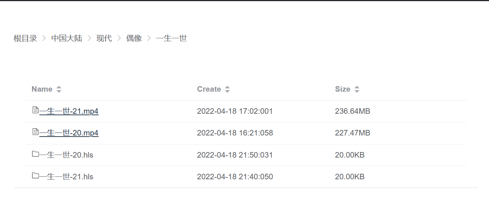

# movie-server
一个自建视频网站的工具，此项目为后端项目，基于springboot构建。前端项目参见[GCS-ZHN/movie-web](https://github.com/GCS-ZHN/movie-web)。为了部署方便，前端静态资源已经构建打包在本项目中。

## 适合场景
视频源在国外等低速访问网站，而本地缓存空间不足或本地观看不便携带。又因为一些资源的私密性等原因不想传到百度云等公共云盘上。

## 依赖
- java 语言依赖，刚需
- ffmpeg 用于转码脚本，非刚需

## 使用方法

```bash
java -jar movie-XXX.jar \
--passwd=生成的SHA256加密密码 \
--resource.path=资源的绝对路径目录 \
```
上述两个参数为可选参数，指定密码时需要安全验证。不指定资源路径时，默认为程序运行时路径为根目录。密码需要通过下列方式生成

```bash
java -jar movie.jar --generatePasswd=你的密码明文

Password is SHA256:KFj5z6JkQNREqA==:b06mKeu9sJIR***3zn6yqaZHRzjuG6UWBo=
```
然后再次启动程序，指定密码。

页面效果如下：



## 支持的视频
- mp4
- m3u8 HLS格式

## 视频转码脚本解释
下列脚本依赖于ffmpeg工具，请预先安装。

- make_m3u8.sh
用于将mp4视频转码生成m3u8 HLS格式。后者更加适合大视频的观看。因为播放mp4时，需要等服务器先将视频全部加载到服务器内存中。大容量的mp4此时预先加载较慢。
```shell
bash make_m3u8.sh 你的mp4文件路径
bash make_m3u8.sh 你的包含mp4文件的目录（不递归）
```

- ts2mp4.sh
用于将ts格式（m3u8 HLS的视频片段）转化为mp4。
```shell
bash ts2mp4.sh 你的ts格式文件路径
```

## m3u8格式视频下载
欢迎访问[GCS-ZHN/m3u8Downloader](https://github.com/GCS-ZHN/m3u8Downloader)

